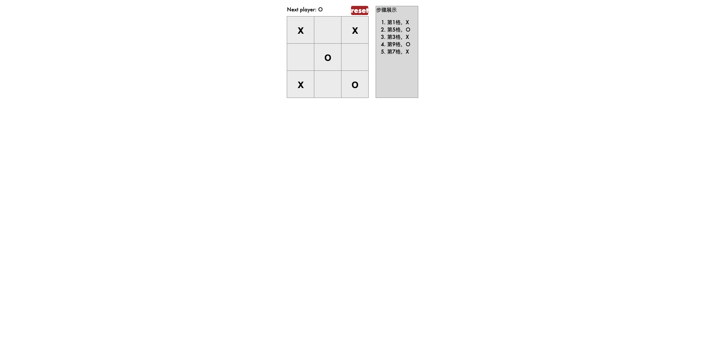

# react实现井字棋

## 呈现效果


## 井字棋判断输赢的逻辑
```js
//squares是棋盘数组，数组item是'X','O','null',数组长度9
function cal(squares) {
    const lines = [
        [0, 1, 2],
        [3, 4, 5],
        [6, 7, 8],
        [0, 3, 6],
        [1, 4, 7],
        [2, 5, 8],
        [0, 4, 8],
        [2, 4, 6],
    ];
    for (let i = 0; i < lines.length; i++) {
        const [a, b, c] = lines[i];
        if (squares[a] && squares[a] === squares[b] && squares[a] === squares[c]) {
        return squares[a];
        }
    }
    return null;
}
```

## 支持scss需要安装node-sass
- `npm install node-sass --save`

## 可以部署成github pages
- 配置package.json的`homepage`
- 配置package.json的scripts的`predeploy`和`deploy`
- 然后`npm run deploy`

## 本地运行项目
- git clone `github address`
- npm install
- npm run start